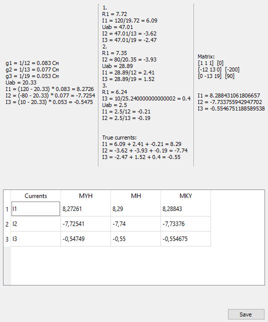

# Программа для решения задач по физике с двумя узлами

Это программа позволяет решать задачи по физике с двумя узлами, где три и более ветви(на каждой ветви по источнику)

## Папки
Как вы можете заметить здесь целые четыре папки, давайте я вам объясню за что какая папка отвечает:

* for_doc - для отображения картинок для этой документации
* Portable - портативная версия(то есть не нужно устанавливать прогу в систему)
* Setup - лежит установщик, который установит программу на ваш компьютер
* Work_dir - это рабочая директория где вы можете увидеть код ну и там последняя версия программы

## Инструкция по использованию

Первое что вы увидите будет вот это 

### Элементы цепи добавление их и редактирование. Добавление ветви.
#### Редактирование элементов цепи
Так выглядят элементы цепи, когда они не редактируются:

Резисторы | Источники
------------ | -------------
 | 

Как вы можете заметить у них есть кнопка edit нажав на которую вы можете их редактировать.

Резисторы | Источники
------------ | -------------
 | 
Одна строчка ввода отвечает за сопротивление резистора | 1-я строчка - напряжение источника   2-я строчка - направление(R - от источника, L - к источнику)   3-я строчка - сопротивление источника

Нажав на кнопку ОК вы вернёте их к виду приведённому выше только уже с вашими значениями.

#### Добавление элементов цепи
За добавление элементов цепи у нас отвечают вот такие простые указатели:

Нажав на которые выплывет окошко с выбором элемента, который вы хотите добавить.
* resistor - вы добавите резистор
* generator - вы добавите источник
* node - **нереализованная** функция параллельных резисторов.

#### Добавление ветви
Кнопка "add new line" отвечает за это она добавит вот это ниже:

### Просмотр решения. Сохранение и открытие решения.
Кнопка "Decide" отвечает за решение задачи и вывода окна с решением.
Это окно выглядит примерно так:

Решение по столбикам(слева-направо):
1. Метод МУН
2. Метод МН
3. Метод МУКУ(сейчас он немного сырой, в плане показа решения)

Ниже находится сводная таблица.
#### Сохранение решения и открытие сохранённого решения.
##### Сохранение решения.
Как вы можете заметить в окне решения есть кнопка save, нажав на которую вы сохраните результаты в папку к которой путь вам покажет программа:

##### Открытие сохранённого решения
На главном окне(где схема) слева сверху есть "кнопка" open saves results, нажав на которую вы можете открыть прошлые сохранённые результаты.

